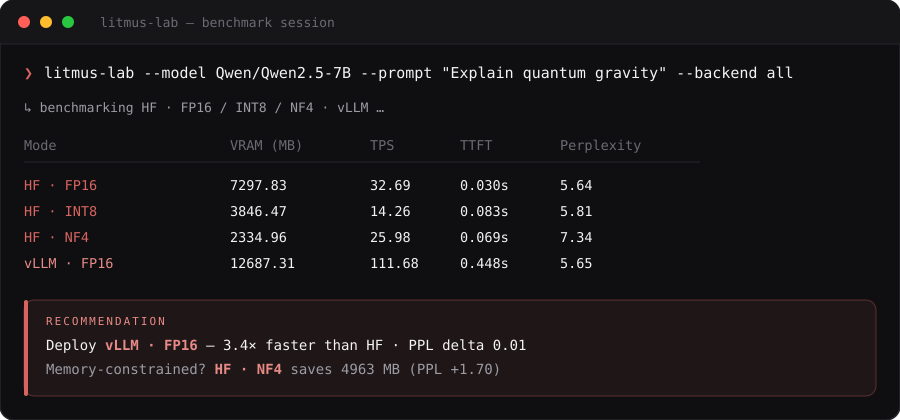
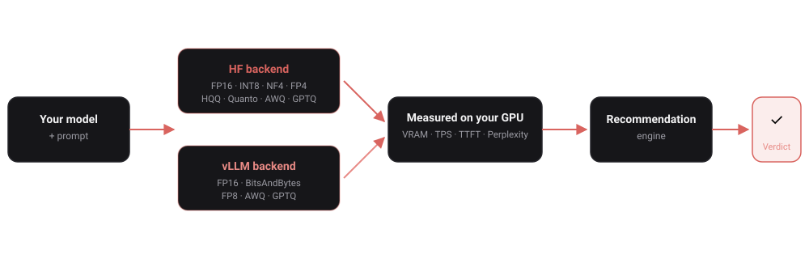
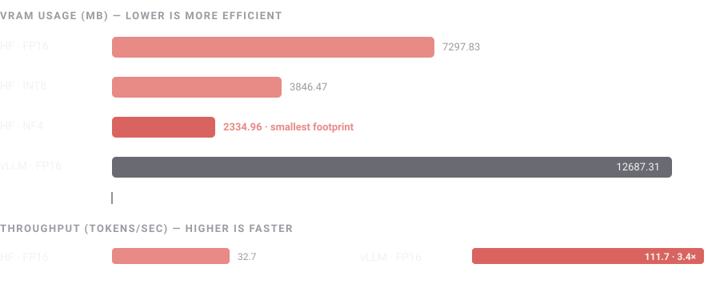

<div align="center">


<p>Benchmark your LLM across quantization formats and backends on your own GPU.<br/>Get one verdict — which precision, which backend, what it costs.</p>

[](https://pypi.org/project/litmus-lab/)
[](https://pypi.org/project/litmus-lab/)
[](LICENSE)
[](https://github.com/NotKshitiz/litmus-lab/commits)
[](https://github.com/NotKshitiz/litmus-lab/stargazers)

</div>

<br/>

<div align="center">

</div>

<br/>

<p align="center">
<a href="#how-it-works">How it works</a> ·
<a href="#installation">Installation</a> ·
<a href="#quick-start">Quick start</a> ·
<a href="#usage">Usage</a> ·
<a href="#ai-recommendations">AI recommendations</a> ·
<a href="#metrics-explained">Metrics</a> ·
<a href="#supported-models">Supported models</a> ·
<a href="#requirements">Requirements</a> ·
<a href="#troubleshooting">Troubleshooting</a> ·
<a href="#whats-being-built-">Roadmap</a>
</p>

---

## What it does

`litmus-lab` runs your model through HuggingFace (FP16, INT8, NF4, FP4, NF4+double-quant, HQQ, Quanto INT8/INT4, plus AWQ/GPTQ against a pre-quantized checkpoint) and vLLM (FP16, BitsAndBytes, FP8, AWQ, GPTQ) in isolated passes — measuring VRAM, throughput, latency and perplexity on your actual hardware — then outputs a single deployment recommendation, shown above.

## How it works

<div align="center">

</div>

Every mode runs in its own isolated pass on your actual GPU — no synthetic benchmarks, no vendor-reported numbers. The recommendation engine then weighs the measured VRAM, throughput, and perplexity delta against deployment thresholds to output one verdict.

### Why quantize at all?

<div align="center">

</div>

Same model, same GPU, same prompt — NF4 reclaims 4963 MB of VRAM versus FP16 at a real but bounded perplexity cost, while vLLM trades extra VRAM for 3.4× the throughput. That tradeoff, measured on *your* hardware and *your* model, is the actual answer litmus-lab gives you.

---

## Installation

```bash
# HF Transformers backend — FP16, INT8, NF4, FP4, NF4+double-quant, HQQ, Quanto INT8/INT4
pip install litmus-lab

# + vLLM backend (FP16, BitsAndBytes, FP8)
pip install "litmus-lab[vllm]"

# + AI recommendations via Groq
pip install "litmus-lab[ai]"

# + AWQ / GPTQ pre-quantized checkpoint support (HF + vLLM)
# Note: gptqmodel builds from source and can fail depending on your CUDA toolchain —
# kept separate from `all` on purpose so a failed build here never breaks the base CLI.
pip install "litmus-lab[awq,gptq]"

# vLLM + AI recommendations (guaranteed to install cleanly — no source builds)
pip install "litmus-lab[all]"
```

> **Note:** vLLM requires Linux or WSL2. It does not run on Windows natively.

---

## Quick start

```bash
litmus-lab \
  --model microsoft/Phi-3-mini-4k-instruct \
  --prompt "Explain the transformer architecture" \
  --backend all
```

---

## Usage

### Flags

| Flag | Description | Default |
|------|-------------|---------|
| `--model` | HuggingFace model repo ID | required |
| `--prompt` | Input prompt | required |
| `--backend` | `hf` · `vllm` · `all` | `hf` |
| `--token` | HuggingFace token for gated models | `None` |
| `--awq-model` | Pre-quantized AWQ checkpoint repo (e.g. `TheBloke/Mistral-7B-v0.1-AWQ`). Enables the HF/vLLM AWQ rows | `None` |
| `--gptq-model` | Pre-quantized GPTQ checkpoint repo (e.g. `TheBloke/Mistral-7B-v0.1-GPTQ`). Enables the HF/vLLM GPTQ rows | `None` |
| `--version` | Print version and exit | — |

### Backend modes

| Mode | What runs |
|------|-----------|
| `hf` | HF Transformers · FP16, INT8, NF4, FP4, NF4+double-quant, HQQ, Quanto INT8/INT4 — plus AWQ/GPTQ if `--awq-model`/`--gptq-model` are given |
| `vllm` | vLLM · FP16, BitsAndBytes, FP8 — plus AWQ/GPTQ if `--awq-model`/`--gptq-model` are given |
| `all` | Both of the above in sequence |

Any mode that hits a missing optional dependency, an unsupported GPU (e.g. FP8 on pre-Hopper hardware), or doesn't fit in VRAM prints a yellow skip line and continues — it won't abort the whole run. Failed modes also show up as their own row in the results table (`Status` column) with a short reason, instead of silently disappearing.

### vLLM configuration

`litmus-lab` currently runs every vLLM mode with a fixed configuration — not yet exposed as CLI flags:

| Setting | Value | Why |
|---------|-------|-----|
| `dtype` | `float16` | consistent precision across all vLLM modes |
| `max_model_len` | `2048` | benchmarks only ever need a prompt + 50 generated tokens (or a 512-token perplexity chunk) — capping this avoids reserving KV cache for the model's full native context (e.g. 32768 for Mistral), which can exceed available VRAM on smaller GPUs long before the KV cache is ever used |
| `gpu_memory_utilization` | computed per run: `min(0.92, (free_VRAM_before_load - 400MB) / total_VRAM)` | adapts to whatever's actually free on your GPU at that moment, leaving roughly an 8% safety margin |
| `load_format` | `bitsandbytes` for the BitsAndBytes mode, `auto` otherwise | matches vLLM's on-the-fly quantization requirement |
| `trust_remote_code` | `True` | needed for some community model architectures |

If a mode's weights + KV cache genuinely can't fit in your VRAM even with this config (e.g. FP16 on a 7B model on a 16GB card, where weights alone can take ~85% of it), that's a real finding, not a bug — it shows up as a failed row in the results table rather than crashing the run, and tells you quantization isn't optional for that model on that GPU.

🚧 **Planned**: flags to override these (`--max-model-len`, `--gpu-memory-utilization`, etc.) so you can tune vLLM's config to your own hardware instead of relying on the fixed defaults above.

### Examples

```bash
# Compare quantization formats
litmus-lab \
  --model Qwen/Qwen2.5-7B-Instruct \
  --prompt "Explain quantum gravity" \
  --backend hf

# vLLM only
litmus-lab \
  --model mistralai/Mistral-7B-Instruct-v0.3 \
  --prompt "Write a Linux shell script" \
  --backend vllm

# Full benchmark — HF + vLLM side by side
litmus-lab \
  --model meta-llama/Llama-3.1-8B-Instruct \
  --token hf_xxxxxxx \
  --prompt "Explain TCP congestion control" \
  --backend all

# Include AWQ / GPTQ rows against pre-quantized checkpoints
litmus-lab \
  --model teknium/OpenHermes-2.5-Mistral-7B \
  --prompt "Explain the theory of relativity in simple terms" \
  --backend all \
  --awq-model TheBloke/OpenHermes-2.5-Mistral-7B-AWQ \
  --gptq-model TheBloke/OpenHermes-2.5-Mistral-7B-GPTQ
```

---

## AI Recommendations

Set a [Groq](https://console.groq.com) API key (free tier) to get an AI-powered verdict from `llama-3.3-70b-versatile` instead of the built-in heuristic:

```bash
export GROQ_API_KEY=gsk_...
litmus-lab --model Qwen/Qwen2.5-7B --prompt "Hello" --backend all
```

No extra flags needed. Falls back to the offline heuristic automatically if the key is missing, rate limit is hit, or there is no internet.

---

## Metrics explained

| Metric | What it measures |
|--------|-----------------|
| **VRAM (MB)** | Peak GPU memory — model weights + KV cache, measured as a before/after delta |
| **TPS** | Tokens generated per second — generation throughput |
| **TTFT** | Time to first token — how quickly the model starts responding |
| **Perplexity** | Language quality on WikiText-2. Lower = better. Delta >2.0 vs FP16 signals degradation |

---

## Supported models

### ✅ HF backend

Any HuggingFace causal language model loadable via `AutoModelForCausalLM`:

| Family | Models |
|--------|--------|
| **Meta** | Llama 3, 3.1, 3.2, 3.3 |
| **Microsoft** | Phi-3, Phi-3.5, Phi-4 |
| **Alibaba** | Qwen2, Qwen2.5 |
| **Mistral AI** | Mistral 7B, Mixtral 8x7B |
| **Google** | Gemma, Gemma 2 |
| **DeepSeek** | DeepSeek-V2, DeepSeek-V3, DeepSeek-R1 |
| **Community** | Falcon, Yi, TinyLlama, Vicuna, Zephyr, WizardLM, and most fine-tunes |

Gated models (Llama, Gemma) require `--token`.

Quantization modes run against the base repo on the fly — no separate checkpoint needed — except AWQ/GPTQ:

| Mode | Notes |
|------|-------|
| FP16 | native precision, no quantization |
| INT8 | bitsandbytes `load_in_8bit` |
| NF4 | bitsandbytes 4-bit, NormalFloat4 |
| FP4 | bitsandbytes 4-bit, FloatingPoint4 |
| NF4 + double quant | NF4 with nested quantization of the quant constants for extra VRAM savings |
| HQQ | Half-Quadratic Quantization — requires `hqq` (bundled by default). Skips cleanly if your transformers version hasn't finished migrating HQQ's loading path yet (`NotImplementedError`) |
| Quanto INT8 / INT4 | `optimum-quanto` weight-only quantization (bundled by default) |
| AWQ / GPTQ | requires `--awq-model` / `--gptq-model` pointing at a pre-quantized checkpoint, plus `pip install litmus-lab[awq,gptq]` |

### ✅ vLLM backend

Same model coverage as HF. VRAM is generally higher than HF at the same precision due to the KV cache pool, but throughput is significantly better under concurrent load.

| Mode | Notes |
|------|-------|
| FP16 | native precision with PagedAttention |
| BitsAndBytes | on-the-fly quantization of the base checkpoint |
| FP8 | on-the-fly W8A8 — requires a Hopper/Ada-class GPU (H100, L4, RTX 4090+); skips cleanly on older GPUs |
| AWQ / GPTQ | requires `--awq-model` / `--gptq-model` pointing at a pre-quantized checkpoint |

### ❌ Not supported

| | Reason |
|-|--------|
| BERT, RoBERTa, encoder-only models | No autoregressive generation |
| T5, BART, mT5, seq2seq models | Different generation API |
| Models that exceed GPU VRAM at FP16 | No CPU offloading yet |
| vLLM on Windows | Use Linux or WSL2 |
| Multi-GPU / tensor parallel | Not yet implemented |

---

## Requirements

- **Python 3.10+**
- **NVIDIA GPU** with CUDA support (CPU works but is very slow, and quantization gives smaller wins there)
- **NVIDIA driver + CUDA 11.8+ / 12.x** for most GPUs. **Exception: Blackwell-generation GPUs (RTX 50-series, compute capability 12.x)** need **CUDA ≥ 12.9 and driver ≥ 575.51** — the `vllm` backend's FlashInfer kernels fail to initialize below that (`RuntimeError: FlashInfer requires GPUs with sm75 or higher` / `SM 12.x requires CUDA >= 12.9`). The `hf` backend is unaffected and works fine on any CUDA version.
- **Disk space** for whatever model you benchmark — 7B models are roughly 15-30GB on disk depending on dtype — plus the small WikiText-2 dataset used for perplexity
- **`--token`** required for gated models (Llama, Gemma, etc.)
- **vLLM backend** (`--backend vllm` / `all`): Linux or WSL2 only, install with `pip install "litmus-lab[vllm]"` — does not run natively on Windows
- **AWQ/GPTQ pre-quantized modes** (`--awq-model` / `--gptq-model`): need `pip install "litmus-lab[awq,gptq]"` and a separately pre-quantized checkpoint repo (e.g. `TheBloke/*-AWQ`) — these don't run against the base model repo

---

## Troubleshooting

### vLLM fails to initialize on Blackwell GPUs (RTX 50-series)

**Symptoms** — one or more of these during `--backend vllm` / `all`, often across every vLLM mode at once:
```
ImportError: vLLM import failed (libcudart.so.13: cannot open shared object file...)
RuntimeError: ... cudaHostGetDevicePointer failed: CUDA driver version is insufficient for CUDA runtime version
Failed to get device capability: SM 12.x requires CUDA >= 12.9.
RuntimeError: FlashInfer requires GPUs with sm75 or higher
RuntimeError: The NVIDIA driver on your system is too old (found version 12080)
```

**Root cause**: these are all symptoms of the same mismatch — Blackwell-generation GPUs (compute capability 12.x) need **CUDA ≥ 12.9 and driver ≥ 575.51** for vLLM's FlashInfer kernels. Which exact error you see depends on which model/quantization mode happens to hit the mismatch first.

**Diagnose:**
```bash
nvidia-smi   # top-right "CUDA Version" is the max your *driver* supports
python -c "import torch; print(torch.version.cuda, torch.cuda.is_available())"
```
If `nvidia-smi` reports less than 12.9, that's confirmed.

**Fix, if you control the host** (your own machine, not a rented container):
```bash
sudo apt update && sudo apt install -y nvidia-driver-575   # or newer — check nvidia.com
sudo reboot
pip uninstall torch torchvision torchaudio vllm -y
pip install torch --index-url https://download.pytorch.org/whl/cu129
pip install vllm
```

**If you're on a rented cloud pod** (RunPod/Vast.ai/Lambda/etc.) — the driver belongs to the host, not your container, so nothing you `pip`/`apt install` inside it can change it. Options:
- Look for a pod template/image explicitly advertising a newer driver or "Blackwell-ready"/CUDA 12.9 support
- Ask the provider's support directly whether such nodes exist
- Provision a fresh pod — driver versions vary node to node

**Careful**: upgrading torch alone to a cu129 build *without* a matching driver makes things worse, not better — torch's own driver check then fails outright (`RuntimeError: The NVIDIA driver on your system is too old`), and `torch.cuda.is_available()` silently returns `False`, so litmus-lab falls back to CPU for *everything*, including the HF backend that was working fine before. If that happens, revert:
```bash
pip uninstall torch torchvision torchaudio -y
pip install torch --index-url https://download.pytorch.org/whl/cu128
```

**In the meantime**: `--backend hf` is unaffected by any of this and works fine on Blackwell GPUs, since it never touches vLLM/FlashInfer.

### vLLM: "No available memory for the cache blocks" / negative KV cache memory

**Symptom:**
```
(EngineCore pid=...) INFO ... [gpu_worker.py:508] Available KV cache memory: -0.14 GiB
ValueError: No available memory for the cache blocks. Try increasing `gpu_memory_utilization`...
```

**This usually isn't a bug** — it means the model's weights alone (plus vLLM's `torch.compile`/CUDA graph overhead) already consume nearly all the VRAM budget, leaving no room for a KV cache at all. It shows up most often running **FP16** on a 7B-class model on a 16GB GPU, where weights alone take ~13-14 GiB. Quantized modes (BitsAndBytes/FP8/AWQ/GPTQ) use roughly a quarter of that for weights and typically have plenty of headroom left over on the same card.

That mode will show up as a failed row in the results table (see the `Status` column) with the short reason, rather than crashing the whole run. If FP16 fails while your quantized modes succeed, that's the actual answer: **quantization isn't optional for that model on that GPU.** See [vLLM configuration](#vllm-configuration) above for exactly what memory budget litmus-lab computes today, and note that per-run tuning flags for this are planned (see roadmap below).

---

## What's being built 🚧

| Feature | Status |
|---------|--------|
| GGUF / llama.cpp backend (CPU + Mac M-series) | 🔨 In progress |
| Cost prediction (`--target-users`, `--gpu-cost`) | 🔨 In progress |
| vLLM config flags (`--max-model-len`, `--gpu-memory-utilization`, etc.) | 📋 Planned |
| Concurrency benchmarking (`--concurrency 1,4,8,16,32`) | 📋 Planned |
| Multi-model comparison in one run | 📋 Planned |
| JSON / HTML report export | 📋 Planned |
| Multi-GPU / tensor parallel benchmarking | 📋 Planned |

> Want to shape the roadmap? [Open an issue](https://github.com/NotKshitiz/litmus-lab/issues) or join the [waitlist](https://litmus-lab-2ku.pages.dev/) for the web platform.

---

## License

MIT
